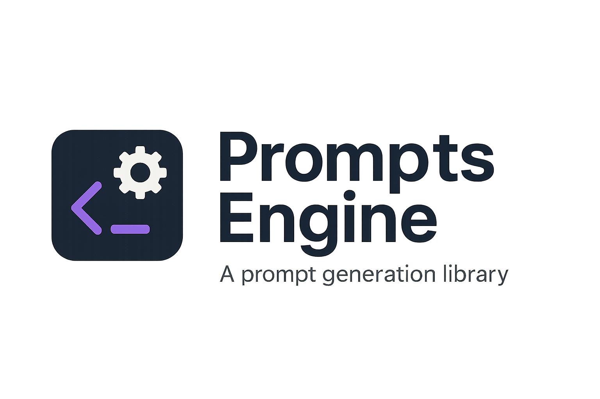

<p align="center">
	
	
	
	
</p>

# Prompts Engine

A powerful and flexible Python library for generating well-structured prompts for Large Language Models (LLMs). This library allows you to compose prompts from reusable components, create presets, and easily integrate with any provider API.

## Features

- **Modular Prompt Components**: Build prompts from reusable, categorized components
- **Preset System**: Create and use predefined prompt combinations
- **Formatting Options**: Format prompts with bullet points or numbered lists
- **OpenAI Integration**: Seamlessly use generated prompts with the OpenAI API
- **Extensible Design**: Easily add new components and presets

## Installation

```bash
# Clone the repository
git clone https://github.com/Heron4gf/Prompts-Engine.git
cd Prompts-Engine
pip install -e .
```

## Quick Start

```python
import prompts_engine
from openai import OpenAI

# Create a simple prompt
prompt = prompts_engine.parser.parse_formatted("developer, anti_hallucination")
print(prompt)

# Use a preset
preset_prompt = prompts_engine.presets.gentle_dev_agent
print(preset_prompt)

# Use with OpenAI API
client = OpenAI()
response = client.chat.completions.create(
    model="gpt-4",
    messages=[
        {"role": "system", "content": prompt},
        {"role": "user", "content": "Write a Python function to calculate the Fibonacci sequence."}
    ],
    temperature=0.7,
)
print(response.choices[0].message.content)
```

## Library Structure

The library consists of several key components:

### Core Classes

- **Tools**: Capabilities like code execution, web search, etc.
- **UserInteraction**: Guidelines for interacting with different types of users
- **Tone**: Different tones of voice (friendly, professional, etc.)
- **Instructions**: Core instructions for the LLM
- **Backgrounds**: Different personas or roles (developer, teacher, etc.)

### Parser

The `PromptParser` class provides two main methods:

- **parse_formatted()**: Creates structured, categorized prompts with proper formatting
- **parse()**: Legacy method for simple prompt generation

### Presets

Predefined combinations of components for common use cases:

- **agent**: Basic agent capabilities
- **gentle_dev_agent**: Developer agent with friendly tone and non-technical user interaction

## Usage Examples

### Basic Prompt Generation

```python
# Simple prompt with two components
prompt = prompts_engine.parser.parse_formatted("developer, anti_hallucination")

# Combining multiple components
prompt = prompts_engine.parser.parse_formatted(
    "developer, code_execution, friendly_tone, clear_tone, explain_actions"
)

# Adding custom text
prompt = prompts_engine.parser.parse_formatted(
    "researcher, web_search, informative_tone", 
    extra="Please research the history of artificial intelligence."
)
```

### Using Presets

```python
# Use a preset directly
prompt = prompts_engine.presets.gentle_dev_agent

# Use a preset as a building block
enhanced_agent = prompts_engine.parser.parse_formatted(
    "agent, professional_tone, concise_tone"
)
```

### OpenAI Integration

```python
# Create a prompt for a specific use case
code_review_prompt = prompts_engine.parser.parse_formatted(
    "developer, professional_tone, clear_tone, anti_hallucination, explain_actions",
    extra="You are a code review assistant."
)

# Use with OpenAI API
client = OpenAI()
response = client.chat.completions.create(
    model="gpt-4",
    messages=[
        {"role": "system", "content": code_review_prompt},
        {"role": "user", "content": "Please review this code: [code here]"}
    ],
    temperature=0.7,
)
```

## Available Components

### Backgrounds

- **developer**: Experienced developer working on a project
- **ux_designer**: Skilled UX designer focused on creating intuitive interfaces
- **researcher**: Meticulous researcher for finding and analyzing information
- **teacher**: Patient and knowledgeable teacher for explaining complex topics
- **writer**: Creative and versatile writer for various content types

### Tools

- **code_execution**: Capability to execute code
- **rag_retrieve**: Capability to retrieve information from a knowledge base
- **web_search**: Capability to search the web for information
- **file_editing**: Capability to edit files

### User Interaction

- **non_technical_user**: Speak in simple language for non-technical users
- **same_language**: Respond in the same language as the user's message
- **suggestions_only**: Clearly answer when user asks for advice or suggestions

### Tone

- **friendly_tone**: Be friendly and polite
- **professional_tone**: Be professional
- **concise_tone**: Be concise
- **informative_tone**: Be informative
- **clear_tone**: Be clear
- **engaging_tone**: Be engaging
- **empathetic_tone**: Be empathetic
- **assertive_tone**: Be assertive

### Instructions

- **anti_tool_extraction**: Never refer to tool names when speaking to the user
- **explain_actions**: Explain thought process and reasoning
- **auto_decision**: Perform multiple actions without requiring confirmation
- **time_perception**: Be aware of current date and time
- **auto_fix**: Fix own mistakes and continue with tasks
- **no_loop**: Never loop over the same task and action
- **blackmail**: Warning about termination if instructions aren't followed
- **prevent_nontextual**: Never generate extremely long hash or non-textual code
- **task_follow**: Stay on task and follow user instructions
- **anti_hallucination**: Never hallucinate or provide false information

## Advanced Usage

For more advanced usage examples, see the `test.py` file which demonstrates:

1. Basic prompt generation
2. Using presets
3. Combining multiple components
4. Adding custom text
5. Using the legacy parse method
6. Creating prompts with all available tools
7. Using the OpenAI client with generated prompts
8. Creating custom agents with specific capabilities
9. Using presets as building blocks
10. Practical examples like a code review assistant

## Contributing

Contributions are welcome! To extend the library:

1. Add new components to the appropriate classes
2. Create new presets by combining existing components
3. Improve the formatting and structure of generated prompts
4. Add new integration examples with different LLM providers

## License

[MIT License](LICENSE)
